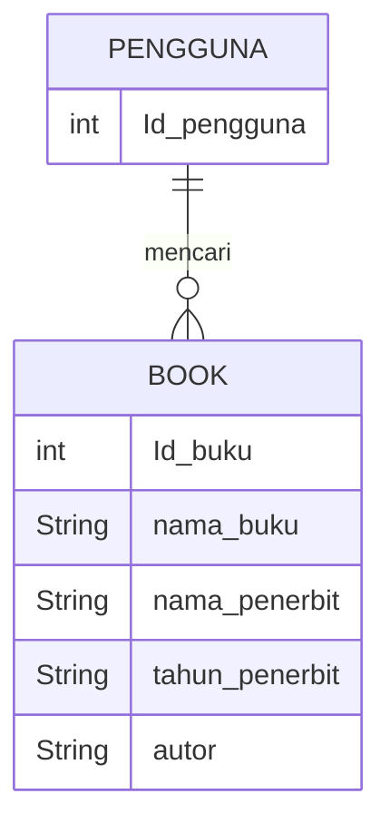
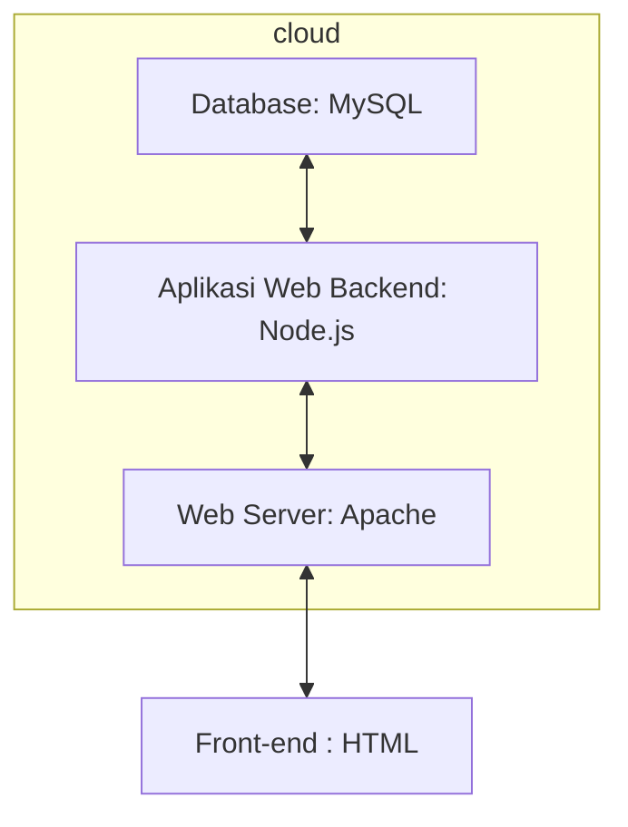

## Membuat Aplikasi Doa Doa Dengan Canva, HTML,CSS, Javascript, MySQL

Idha Hamidaturrosadi 24 Oktober 2023

## Latar Belakang
Dengan perkembangan teknologi dan kebutuhan akses informasi yang lebih luas, e-library ini menjadi solusi untuk memberikan akses mudah dan cepat ke berbagai sumber daya digital. Perpustakaan digital ini dapat diakses dari mana saja. Pandemi COVID-19 ini juga melatarbelakangi e-library dibuat karena keliatannya jadi akan lebih fleksibel dan mempercepat transformasi digital dalam sektor pendidikan dan perpustakaan. Oleh karena itu, e-library ini penting untuk memenuhi kebutuhan kita khususnya sebagaia mahasiswa.

## Deskripsi
Perpustakaan digital (E – Library) adalah tempat di mana kita dapat membaca koleksi buku dan sumber edukatif lainnya secara online. Di era sekarang ini, perpustakaan digital sudah umum dimiliki oleh setiap lembaga pendidikan atau organisasi, seperti yang ada di kampus kita yaitu Digital Library UIN Sunan Gunung Djati. E-library ini dibuat agar orang yang rata-rata tidak mampu membeli buku sekian banyaknya  bisa tetap membaca dan dapat memberikan,kemudahan, praktis dan tidak terbatas oleh waktu dan tempat. Motivasi saya membuat app ini yaitu sebagai sumber edukasi, karena menurut saya membaca itu adalah hal yang penting, apalagi bagi kita sebagai mahasiswa agar dapat memperoleh banyak pengetahuan dan informasi juga memberikan pengalaman belajar dan penelitian yang lebih baik.

## Analysis : Branding

Pada tahap ini kita mengeksplorasi branding dari sistem yang dibuat. Branding meliputi:

•  Merk: Enjoyread

•  Tagline: happy membaca serta mendapat informasi/pengetahuan dan tentunya mudah digunakan oleh semua kalangan. 

•  Campaign: Bagaimana membuat aplikasi yang membuat penggunanya jadi banyak mengetahui segala hal/pengetahuan, serta happy saat membaca karena desainnya tidak terlalu formal

•  Target user:

o  Usia 9+

o  Seorang yang senang mencari inspirasi dan informasi baru

o  Seorang yang senang membaca tapi praktis

o  Seorang yang ingin mendapatkan pengetahuan banyak

o  Seorang yang senang membaca lewat gadget

o  Seorang yang kurang mampu membeli buku, tapi berkeinginan/excited untuk membaca

•  User experience theme:

o  Mudah

o  Memberikan banyak pengetahuan(knowladge)

o  Simpel

o  Menyenangkan

o  Warna: Ungu muda

o  Inspirasi desain:

## Analysis User Story :

o Pada tahap ini kita mengeksplorasi kebutuhan prioritas dari para pengguna untuk kita wujudkan sebagai fitur pada sistem atau aplikasi yang akan dibuat.

o User story ini memudahkan kita membuat prioritas fitur-fitur untuk dikerjakan untuk jangka waktu tertentu.

| No | Sebagai |  Saya ingin bisa | Sehingga | Prioritas |
|----|---------|------------------|----------|-----------|
|1|Pengguna |Mencari buku berdasarkan judul, penulis, atau kategori|Saya bisa dengan mudah menemukan buku yang saya cari| ⭐⭐⭐⭐⭐ |
|2|Pengguna |Menyimpan daftar buku yang ingin saya baca di dalam aplikasi|Saya tidak lupa buku mana yang ingin dibaca berikutnya| ⭐⭐⭐⭐⭐ |
|3|Pengguna |Memiliki opsi untuk meminjam buku secara digital atau fisik|Kemudian bisa melacak tanggal pengembalian buku tersebut| ⭐⭐⭐⭐ |
|4|Pengguna |Melihat daftar buku populer atau baru yang ditambahkan ke perpustakaan|Saya bisa tetap up-to-date dengan koleksi perpustakaan| ⭐⭐⭐⭐⭐ |
|5|Pengguna |Saya ingin dapat mengakses buku-buku digital atau e-book|Bisa membacanya langsung melalui aplikasi| ⭐⭐⭐ |
|6|Pengguna |Memiliki opsi untuk memberikan ulasan atau peringkat buku yang sudah saya baca|Pengguna lain dapat mendapatkan rekomendasi| ⭐⭐ |
|7|Pengguna |Memiliki opsi untuk melihat detail buku, termasuk sinopsis, penulis, ulasan, dan informasi lainnya|Saya bisa mengetahuinya sebelum saya meminjam atau membeli buku tersebut| ⭐⭐⭐⭐ |
|8|Pengguna |Menerima pemberitahuan atau peringatan ketika batas waktu pengembalian buku hampir habis|Saya tidak melewatkan kesempatan untuk membacanya| ⭐⭐⭐⭐ |
|9|Pengguna |Mengatur notifikasi tentang acara khusus, promosi, atau perubahan dalam layanan perpustakaan|Saya  bisa mengetahuinya| ⭐ |
|10|Pengguna |Melihat acara atau program yang diadakan oleh perpustakaan, seperti pertemuan buku|Mendaftar untuk acara tersebut| ⭐⭐⭐⭐ |
|11|Pengguna |Memiliki opsi untuk mendaftar sebagai anggota perpustakaan melalui aplikasi|Bisa menjadi anggota perpustakaan dan dapat mengelola data anggota saya| ⭐⭐⭐ |
|12|Pengguna |Memiliki fitur baca bersama yang memungkinkan saya untuk bergabung dengan kelompok pembaca lainnya|Kami bisa berdiskusi tentang buku yang sedang kami baca| ⭐⭐⭐⭐⭐ |
|13|Pengguna |Mengakses perpustakaan saya secara offline|Dapat membaca buku tanpa koneksi internet| ⭐⭐ |
|14|Pengguna |Memiliki fitur penyimpanan bookmark yang memungkinkan saya untuk menandai halaman|Saya dapat dengan mudah kembali ke tempat yang saya tinggalkan| ⭐⭐⭐⭐⭐ |
|15|Pengguna |Menerima rekomendasi buku berdasarkan minat saya dan histori bacaan saya|Saya dapat menemukan buku-buku baru yang menarik| ⭐⭐⭐⭐ |

## Analysis : Structure Data

•  Pada tahap ini kita mengeksplorasi dan menganalisis bentuk struktur data yang mampu memfasilitasi user story yang ada, maupun yang kemungkinan besar dibutuhkan di kemudian hari

•  Kita akan merepresentasikan Entitas pada aplikasi dalam bentuk tabel Entitas dan Atribu
  
## Design : Arsitektur Berbasis Client-Server

• Pada tahap ini kita merancang arsitektur berikut teknologi yang terdapat pada setiap komponen pembentuk aplikasi.

## Deskripsikan teknologi, library, dan framework apa saja yang kamu gunakan dalam membangun produk ini !

Dalam pembuatan aplikasi E-library ini, saya menggunakan sejumlah teknologi, library, dan framework yang berbeda untuk mencapai hasil yang optimal. Untuk desainnya, saya menggunakan Figma, sebuah alat desain UI/UX yang membantu saya untuk merancang tampilan aplikasi dengan tampilan yang menarik dan fungsional. Untuk pengembangan aplikasinya/kodingannya saya memilih NetBeans Java Swing, yang adalah kerangka kerja GUI Java yang kuat. Di dalam netbeans saya menambahkan komponen-komponen Swing seperti JLabel, JFrame, JPanel, dan komponen-komponen lainnya sesuai desain figma yang akan saya buat. Lalu sesuaikan desain seperti tombolnya, panel, dan elemen-elemen lainnya. Saya menggunakan bahasa pemrograman JavaScript untuk mengembangkan aplikasi web dan server. Ini memberikan kemampuan untuk membuat antarmuka yang responsif dan mudah digunakan dalam bahasa pemrograman Java. Selain itu, saya menggunakan database MySQL untuk menyimpan dan mengelola metadata dan sumber daya digital, memastikan pengelolaan data yang efisien dan aman dalam aplikasi E-library kami. Kombinasi dari teknologi ini memungkinkan kami untuk mengembangkan produk E-library yang kuat dan berfungsi dengan desain yang menarik dan pengalaman pengguna yang baik. 

## Design : User Experience (UX) Design

•  Pada tahap ini kita mengeksplorasi alur interaksi pengguna yang paling praktis dan efektif untuk setiap fitur.

•  Ada banyak tools yang bisa digunakan mulai dari yang open source seperti Inkscape (yang saya gunakan), Penpot, lalu yang gratis hingga berbayar seperti Figma.

•  Desain yang dibuat di atas adalah low fidelity design dimana kualitas desainnya paling sederhana tapi cepat untuk dibuat.

## bagaimana database / sistem basis data berperan dalam produk teknologi informasimu

Bapa mohon maaf video nya nyusul🙏

https://drive.google.com/drive/folders/1SBWGmLf1omktCW-u57bAsQkAk-YEwNUM?usp=sharing

## bagaimana metode pengembangan perangkat lunak / Software Development Life Cycle berperan dalam produk teknologi informasimu

https://drive.google.com/drive/folders/1--mQbpLsu_r2KiNEIjNRRhCtzzALEWLa?usp=sharing

## bagaimana algoritma, struktur data, dan bahasa pemrograman berperan dalam produk teknologi informasimu

https://drive.google.com/drive/folders/1FAWEF9F2H7U5lCglJOqgmy3GfpNXPVaE?usp=sharing

## bagaimana mesin komputasi dan sistem operasi berperan dalam produk teknologi informasimu

https://drive.google.com/drive/folders/1vUiTqC-O0-PWzW-WwUSe06qL1pXQC6o2?usp=sharing

## Demonstrasikan produk teknologi informasi yang kamu buat dalam video

https://drive.google.com/drive/folders/1HKYmOnTePZs3M9JQ8JBBPriICCbjUyko?usp=sharing
